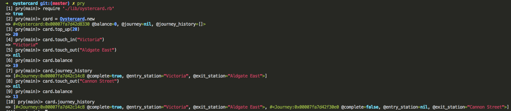

# Oystercard Challenge

### Description

A command line app that emulates travelling on the London Underground. 

### Installation

Use:

`Ruby version 2.5.0`

Install Bundler and the relevant gems with the below commands:

`gem install bundler`

`bundle`

To run the programme, use the below command in irb / pry:

```require './lib/oystercard.rb'```

### App running in command line



### Development Process

Improving upon Week 1, we tried our hands at separating out responsibility into separate classes. As you can see there is still much improvement to be made. 
The task was to emulate an oystercard as much as possible, initiating a new card, topping up, travelling between stations, incurring fines for inappropriate use, storing journey history etc. 
The next steps would be to implement logic that would allow stations to be in different zones and journeys priced accordingly. 
